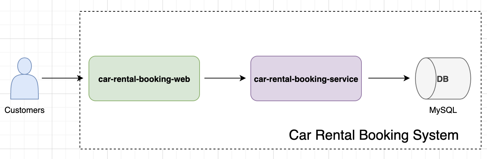

# Car Rental Booking System

### User Scenario

[Live Demo](http://demo.lucienchen.xyz)  
When talking about rental booking system, I believe there are two baisc user scenarios, the first one is to let customers to go through all the car information including what kinds of car they can rent and how many car left in the stock. And the second one is base on these info, customers should be able to make an order, close order, or even delete an order. Considering we only have 4 days to implement this system, so we won't expand any other user scenarios.

### Scope

The core business of a booking system is to constantly maintain stock information when process rental orders. So, in order to keep this system as simple as possible, we only keep three modules `rental order`, `stock` and `car`. As for `payment`, `customer` modules are not in scope. 

### Design

This service is implemented base on SpringMVC + Spring-boot + JPA + MySQL.  
 
 
#### DB Schema

**TABLE - rental_order**
| Field | Type | Null | Key | Extra |
| -- | -- | -- | -- | -- |
| rental_order_id | smallint | NO | PRI | auto_increment |
| user_id | varchar(20) | NO |  |  |
| stock_id | smallint | NO | | |
| rental_start_time | timestamp | YES | | |
| rental_target_end_time | timestamp | YES | | |
| rental_actual_end_time | timestamp | YES | | |
| last_update | timestamp | NO | | |
| delete | tinyint | NO | | |

**NOTICE**  
Field `rental_actual_end_time` is null by default. Only when customers return cars to the company, then it will be assigned a non-null timestamp. So this field can help to indicate the order status.  
Field `delete` is actually a soft delete solution, when customs delete specific order, the delete value will turn to `1`.  
Only when field `rental_actual_end_time` is non-null, can customers delete rental orders.

**TABLE - stock**  
| Field | Type | Null | Key | Extra |
| -- | -- | -- | -- | -- |
| stock_id | smallint | NO | PRI | auto_increment |
| car_id | smallint | No | | |
| current_rental_order_id | smallint | YES | | |

**NOTICE**  
Because the business scenario is car rental, so each stock is very expensive and should be easy to track. So I added a field `current_rental_order_id` under into stock table. Default value is `"-1"` and it means available, when this stock is in used, will sync the rental_order_id here, with this, it will be easy to track the situation.

**TABLE - car**
| Field | Type | Null | Key | Extra | 
| -- | -- | -- | -- | -- | 
| car_id | smallint | NO | PRI | auto_increment |
| brand | varchar(20) | YES | | |
| model | varchar(20) | YES | | |
| cost_per_day | decimal(4,2) | YES | |

#### APIs Spec

[Swagger entrance](http://www.lucienchen.xyz:8080/service/swagger-ui.html). 

